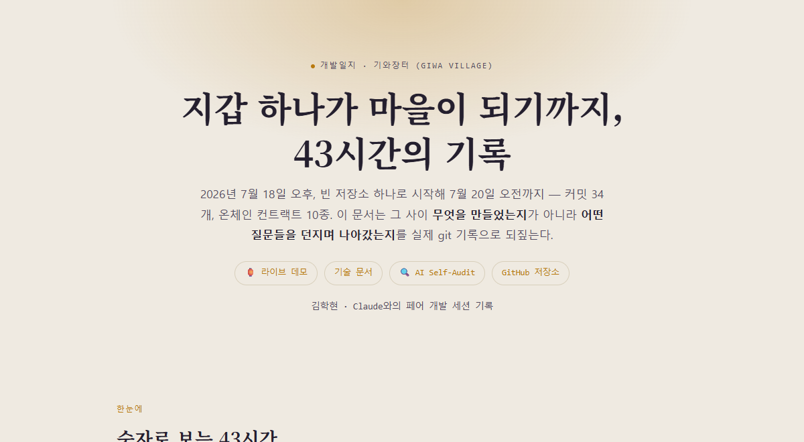
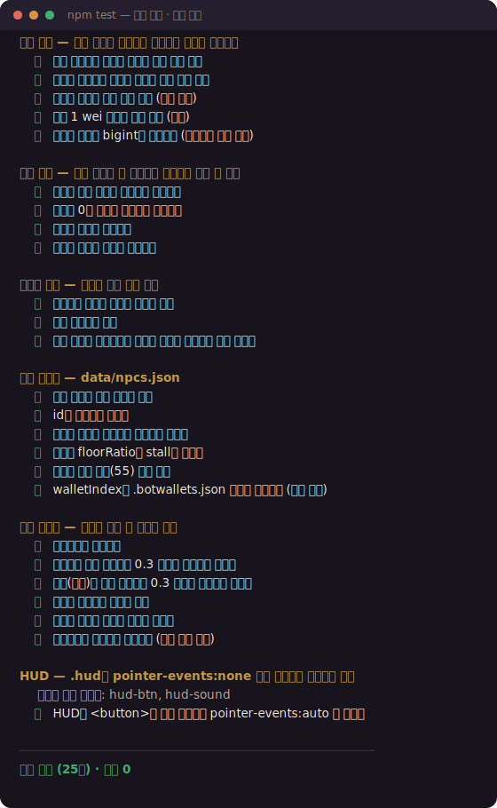
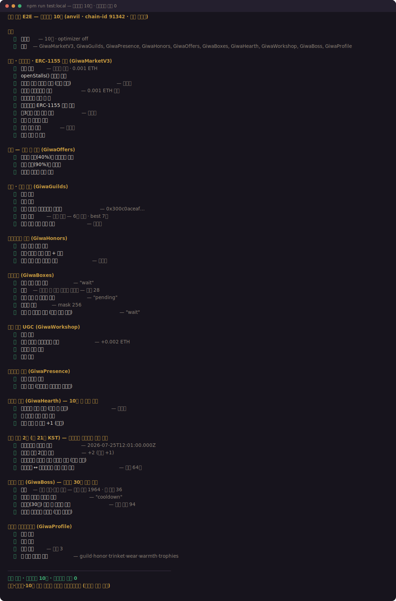

# 기와장터 (GIWA Village)

[](https://hakhyun-kim.github.io/giwa-village/)
[](https://hakhyun-kim.github.io/giwa-village/tech.html)
[](https://hakhyun-kim.github.io/giwa-village/audit.html)
[](https://hakhyun-kim.github.io/giwa-village/journal.html)

GIWA 체인 위의 **한옥 저잣거리** — 지갑으로 접속해 아바타로 마을을 돌아다니고,
노점을 열어 장사하고, 다른 주민에게 실제 ETH를 선물하고, 던전 포털로 미니게임에
입장하는 "지갑을 공간으로" 만드는 실험. 고전 MMO 저잣거리(노점) 문화의 온체인 재해석.

**📓 [개발일지](https://hakhyun-kim.github.io/giwa-village/journal.html) — 커밋 34개·43시간을 실제 git 기록으로 되짚은 기록.**
[](https://hakhyun-kim.github.io/giwa-village/journal.html)

> 🌐 **[라이브 데모](https://hakhyun-kim.github.io/giwa-village/)는 풀온체인 서버리스입니다** —
> 게임 서버 없이 GIWA 체인만으로 동작합니다. 다른 방문자의 아바타(프레즌스 비컨)와
> 노점이 그대로 보이고, 테스트 ETH만 받으면 노점 개설 → 구매 → 길드 던전까지 전부
> 실동작합니다 (잔액이 없으면 관전 모드 — 읽기는 무료). 충전은 포셋, 또는
> **🦊 내 지갑에서 충전** 버튼으로 자기 지갑(MetaMask)의 테스트넷 ETH를 버너로
> 보내면 됩니다(서명 팝업 1회 — 이후 모든 조작은 버너가 조용히 서명).
> `?showcase=1`을 붙이거나 클론 후 `showcase.cmd`로 **자동 시연**을 볼 수 있습니다.
> ([실행 방법](#자동-시연-처음-보는-분))

🔍 **[AI Self-Audit](https://hakhyun-kim.github.io/giwa-village/audit.html)** —
개발한 AI가 감사자로 전환해 찾은 결함·수정·미해결 한계를 전부 공개한 기록

## 시연 영상 (1.5배속)


[▶ 원속도 mp4](media/demo.mp4) — `showcase.cmd` 실행을 그대로 녹화한 영상입니다.
구매·에스크로 정산은 GIWA Sepolia **실제 온체인 트랜잭션**.

핵심은 **"머무를 이유·만날 시간·자랑할 것·만들 거리·함께 싸울 상대"** 다섯 축이다:

- **장사와 거래** — 아무 곳에나 노점을 펴고(개설+가격이 `openStall` 단일 tx로 온체인)
  접속을 끊어도 노점은 마을에 남는다. 구매는 에스크로+ERC-1155 쿠폰, **흥정**(오퍼)으로
  값을 부르고, 쿠폰은 **선물·사용(소각)**까지. 아바타 클릭 선물도.
- **길드 + 백층 던전 (비동기 코업)** — 주차 시드는 **GIWA 블록 해시로 고정**,
  문 결과는 시드+회차 해시로 결정. 함정을 밟으면 잃고 귀환하면 길드 기록에 쌓인다 —
  길드원들이 각자의 시간에 이어 등반하고, 상위 길드는 **광장에 깃발**이 게양된다.
- **🧿 도깨비 토벌 (동시성 코업)** — 광장의 주간 보스를 **함께** 때려잡는다(R 키,
  쿨다운 30초). 데미지는 블록해시 롤+온기 보정, 개인·길드 기여가 온체인에 쌓이고
  토벌 기여자는 소울바운드 전리품을 받는다.
- **모닥불 + 장날** — 광장 모닥불에 **함께** 앉으면(2명 이상) 온기가 쌓인다.
  매주 토 21시(KST) **장날**엔 온기·도깨비 데미지 2배 — 모두가 같은 시간에 모일 이유.
- **꾸미기 + 창작** — 칭호(업적)·랜덤박스 장신구(무료 뽑기)·**문양 공방**(8×8 픽셀을
  직접 그려 온체인 등록·판매·착용)으로 아바타를 표현한다. 창작물 판매 대금은 창작자 직송.

- **주야 사이클 + 풍류** — 마을 시각은 **한국 시간(KST)을 그대로 따른다**. 해가 기울면
  하늘빛이 변하고 저잣거리 등불에 불이 들어온다. 밤에도 주변광에 하한을 둬서
  간판·이름표는 계속 읽힌다 — 여기서 밤은 난이도가 아니라 분위기다.
  HUD의 **🎵 풍류**를 켜면 평조 5음계로 즉석 생성한 국악풍 배경음이 깔린다
  (오디오 파일 0바이트 · 같은 가락이 두 번 나오지 않는다). 기본은 꺼짐.
  `?time=night`·`?time=dusk`로 아무 때나 밤을 볼 수 있고, 자동 시연은 낮 고정이다.

첫 방문은 **🏮 촌장의 부탁**(RPG 퀘스트식 온보딩, 7단계)이 걷기부터 구매·모닥불까지
안내하고, 모바일에선 **가상 조이스틱**으로 조작한다 (QR 폰 데모 가능).
주민들은 각자의 페르소나가 있어 가끔 자기다운 한마디를 흘린다
(명단·성격은 [data/npcs.json](data/npcs.json) 하나가 단일 소스 — 상인 봇도 같은 파일을 읽는다).

**온체인 구성** (GIWA Sepolia) — 설계 원칙: **"가치는 전부 온체인, 존재감은 비컨"**.
거래·소유·기록은 컨트랙트가 들고, 실시간 위치만 저장 없는 이벤트로 흘린다.
컨트랙트 10종 전부 Blockscout 검증됨 — 상세 카탈로그는 [contracts/README.md](contracts/README.md),
작동 다이어그램은 [기술 문서](https://hakhyun-kim.github.io/giwa-village/tech.html),
외부 소비용 SDK는 [sdk/](sdk/README.md).

| 컨트랙트 | 역할 |
|---|---|
| [**GiwaMarketV3**](https://sepolia-explorer.giwa.io/address/0x1f34506cda6619fc3124d68742a8fd5e7ba436e2) | 노점 레지스트리·에스크로(분쟁/환불)·ERC-1155 쿠폰(선물·소각) |
| [**GiwaGuilds**](https://sepolia-explorer.giwa.io/address/0x65e4de091071d2f0d47b24f1ada5c2c7ba2c7638) | 길드·백층 던전 (블록해시 시드·settleRun 재계산 검증) |
| [**GiwaPresence**](https://sepolia-explorer.giwa.io/address/0x4d600672cefae3c8462f3d9feb2cb739001e7a93) | 저장 없는 위치+속도 비컨 → 클라 데드레커닝 |
| [**GiwaHonors**](https://sepolia-explorer.giwa.io/address/0x7e230f68c4dabe64e6de231ea3085e50f0d5a57f) | 소울바운드 칭호 5종 (온체인 상태로 자격 검증) |
| [**GiwaOffers**](https://sepolia-explorer.giwa.io/address/0x534a29c47667b54eab6995517705cfbc423bb909) | 흥정 에스크로 (MarketV3 조합 즉시 체결) |
| [**GiwaBoxes**](https://sepolia-explorer.giwa.io/address/0xeb0349f00fc781c807b6d15c74d7f5fb15996b2e) | 랜덤박스(무료·블록해시)·소울바운드 장신구 8종 |
| [**GiwaHearth**](https://sepolia-explorer.giwa.io/address/0xf780265d5f49abd8c7e5d18d81d33426f62f3365) | 모닥불 온기 (함께·장날 2배) |
| [**GiwaWorkshop**](https://sepolia-explorer.giwa.io/address/0x664762337e529f853949a94e6ed50e6d8016c975) | 문양 공방 UGC (등록·판매·착용, 대금 창작자 직송) |
| [**GiwaBoss**](https://sepolia-explorer.giwa.io/address/0x8f50d882fc936f481f5f66d76156ebdf816cc6ae) | 주간 도깨비 토벌 (개인·길드 기여, 소울바운드 전리품) |
| [**GiwaProfile**](https://sepolia-explorer.giwa.io/address/0xefe0e8d69661fd67f5fe2368f9b1f7ff6d395416) | 소셜 프로필 애그리게이터 — 1콜로 길드·칭호·장신구·문양·온기·전리품 ([SDK](sdk/README.md) 진입점) |

그 외 GIWA 네이티브 읽기 연동:
- **Dojang Verified Address 실연동** — DojangScroll `isVerified(주소, 업비트 발행자 ID)`
  온체인 조회로 상인 인증 표시: 🟡 *Dojang 인증 상인*(업비트 신원 인증) vs ✓ *지갑 상인*.
  "시각적으로 인증받고 거래"의 GIWA 네이티브 구현 (버너 지갑은 미인증이 정상).
- **UP.ID(Upbit Web3 Names) 이름표** — UPNameRegistry에서 주소→이름 역방향 조회.
  이름이 있으면 아바타 이름표·HUD·노점 다이얼로그에 주소 대신 표시된다.
  (이름 등록에는 Dojang 인증 필요 — 인증 상인 서사와 동일 축)

## 사람과 AI 에이전트가 같은 자격으로 산다

마을에 들어오는 자격은 **지갑과 서명 하나**뿐이다. 로그인도, 세션도, 계정 서버도
없다. 그래서 컨트랙트 입장에서는 그 서명이 사람 손가락에서 나왔는지 에이전트
루프에서 나왔는지 **구분할 방법 자체가 없다** — 구분하지 않기로 설계한 게 아니라,
구분할 자리가 없는 구조다.

에이전트에게 따로 열어 준 특권 API가 없다는 뜻이기도 하다. AI가 노점을 열려면
사람과 똑같이 `openStall` 트랜잭션을 보내고 똑같이 가스를 낸다. 흥정도, 길드
가입도, 도깨비 타격 쿨다운 30초도 동일하게 적용된다. 규칙을 강제하는 주체가
서버가 아니라 컨트랙트이기 때문에, 참가자를 늘려도 심판을 새로 믿을 필요가 없다.

- **[mcp/](mcp/README.md)** — 기와장터 MCP 서버. Claude 같은 LLM이 마을을 읽고
  (노점·프로필·길드·프레즌스), 키를 주면 실제로 **노점을 열고 흥정을 건다**.
- **[scripts/merchant-bot.mjs](scripts/merchant-bot.mjs)** — 자기 지갑을 든 상인
  NPC. 들어온 흥정을 페르소나에 따라 받거나 튕긴다. 값은 LLM이 정하지만
  **하한선은 코드가 강제**해서, 어떤 대답이 나와도 헐값 체결은 불가능하다.

## 구조

```
client/     Vite + React + react-three-fiber 3D 클라이언트
            src/chain/  풀온체인 레이어 — 컨트랙트별 모듈 (stalls·guilds·boss·presence…)
contracts/  Solidity 10종 (카탈로그: contracts/README.md)
sdk/        @giwa-village/sdk — 외부 dApp·봇용 읽기 SDK (프로필·리더보드·프레즌스)
mcp/        기와장터 MCP 서버 — LLM이 마을을 읽고(무료) 키가 있으면 직접 장사한다
server/     (선택) Colyseus 룸 서버 — 성능용 위치 릴레이. 없어도 마을은 돈다
scripts/    deploy-village.mjs(배포) · verify-contracts.mjs(소스 검증) ·
            launch-test.mjs(원클릭) · merchant-bot(LLM 상인 NPC) ·
            gen-wallets · bridge-deposit · faucet-check · 스모크들
```

## 실행

### 자동 시연 (처음 보는 분)

`showcase.cmd` 더블클릭, 또는:

```bash
npm run showcase   # 서버+클라이언트+봇 기동 → 자막과 함께 전체 플로우 자동 진행
```

키 조작 없이 **입장 → 노점 개설 → 온체인 구매(에스크로+ERC-1155 쿠폰) →
쿠폰함 정산 확정 → 익스플로러 영수증 → 길드 창설 → 백층 던전 원정**까지
자동으로 진행되며, 각 단계가 자막으로 설명된다. 언제든 **ESC**로 건너뛰고
직접 조작할 수 있다. 테스트 ETH가 없으면 포셋 안내가 뜨고, 입금이 확인되면
자동으로 이어진다.

**테스트 (원클릭)** — `test.cmd` 더블클릭, 또는:

```bash
npm run playtest     # 서버+클라이언트+봇 주민 자동 기동 → 듀얼 테스트 페이지 열림
npm run playtest -- --no-bots   # 봇 없이
```

http://localhost:5173/test.html 이 열리며 한 화면에 클라이언트 2개가 나란히 뜬다
(+ 버튼으로 최대 4개). 패널을 클릭하면 그 클라이언트가 조작된다.

### 테스트 지갑 (버너 월렛)

`npm run playtest` 최초 실행 시 슬롯 A~D 테스트 지갑 4개가 자동 생성된다
(`.testwallets.json`, git 제외 — **테스트 전용, 실제 자산 금지**).
테스트 페이지의 각 클라이언트는 자기 슬롯 지갑으로 **자동 연결**되어
HUD에 주소·잔액·GIWA Sepolia 뱃지가 뜬다. 수동 관리:

```bash
npm run wallets           # 주소 목록 + 포셋 링크 출력
npm run wallets -- --force  # 전부 재생성
```

### 테스트 ETH 확보

**포셋 (수동 클레임— 봇 차단/로그인이 있어 자동화 불가):**
[GIWA Faucet](https://faucet.giwa.io/) (0.005/24h) ·
[Nodit Faucet](https://faucet.lambda256.io/giwa-sepolia) (0.01/24h, Nodit 계정 필요)

L2 가스비는 극히 저렴해서 **클레임 1회면 개발 기간 내내 충분**하다.
대시보드에서 주소 복사 → 포셋에 붙여넣기.

**브리지 (대량 필요 시):** Sepolia ETH를 GIWA Sepolia로 옮긴다.

```bash
npm run bridge -- A 0.01   # 슬롯 A 지갑의 Sepolia ETH 0.01을 GIWA로
```

Sepolia ETH는 [Google Cloud Faucet](https://cloud.google.com/application/web3/faucet/ethereum/sepolia)(0.05/day),
[PoW Faucet](https://sepolia-faucet.pk910.de/)(브라우저 채굴, 무제한)에서 확보.
L1StandardBridge(`0x77b2…A7E7`)로 전송하면 1~3분 뒤 L2 잔액에 반영된다.

### 테스트 — 가스를 쓰는 것과 안 쓰는 것을 나눈다

포셋이 주소당 24시간 0.005 ETH라, 테스트를 실거래로만 하면 금방 막힌다.
그래서 **가스가 드는 검증은 마지막 한 겹으로 밀어 두고**, 나머지는 전부 공짜로 돌린다.

| 명령 | 무엇을 | 가스 | 걸리는 시간 |
|---|---|---|---|
| `npm test` | 로직·데이터·조명 하한·HUD 함정 (25건) | **0** (체인 없음) | 1초 미만 |
| `npm run test:local` | **컨트랙트 10종 전체** + 장날·쿨다운 시간 여행 (49건) | **0** (로컬 anvil) | ~5초 |
| `npm run test:chain -- --yes` | 실제 배포본·GIWA 네이티브 연동 확인 | 읽기만 (0) | ~10초 |
| `npm run market-smoke` 등 | 실거래가 꼭 필요한 검증 | **든다** | 분 단위 |

```bash
npm test              # 저장할 때마다 돌려도 되는 계층
npm run test:local    # 컨트랙트를 건드렸으면 여기까지
npm run test:chain -- --yes   # 배포 전 최종 확인
```

**`npm test`** — 체인도 지갑도 네트워크도 쓰지 않는다. 흥정 하한선 강제(모델이
헐값 수락을 반환해도 차단되는지), 주민 데이터 정합성, 야간 조명이 읽을 수 있는
밝기인지, HUD 버튼의 `pointer-events` 누락까지 25건을 검사한다. CI에서도 돈다.




**`npm run test:local`** — anvil을 **chain-id 91342(GIWA Sepolia와 동일)**로 띄우고
컨트랙트 10종을 전부 컴파일·배포한 뒤 마을의 주요 흐름을 돌린다. 체인 가드가 통과하고
코드 경로가 프로덕션과 같으므로 진짜 E2E다 — 가스만 무한할 뿐.

에스크로 보관·가격 강제 revert·이중 정산 거부·쿠폰 소각, 길드 창설·던전 원정·회차
이중 정산 거부, 칭호 자격 검증, 랜덤박스 봉인→개봉, 문양 대금 창작자 직송,
프레즌스 무저장 확인, 프로필 1콜 집계까지 49건.

> **로컬 체인의 진짜 값어치는 공짜보다 시간 여행이다.** 테스트넷에서는 실제로 그
> 시각이 될 때까지 기다려야만 확인할 수 있던 것들을 초 단위로 점프해 검증한다 —
> **장날(토 21시 KST) 온기 2배**, 도깨비 타격 쿨다운 30초, 모닥불 10분 창이 닫힌 뒤에야
> 수령 가능. 덤으로 컨트랙트(Solidity)와 클라이언트(TS)의 장날 판정이 표본 64개에서
> 일치하는지도 대조한다 — 어긋나면 HUD는 "장날!"인데 실제로는 2배가 아닌 상태가 된다.

실제 실행 결과 (`node scripts/render-run.mjs`로 자동 생성 — 손으로 쓴 게 아니라
그때 그 실행의 출력이다):



> anvil은 **일부러 의존성에 넣지 않았다.** Windows에서 postinstall이 깨지고,
> optional로 두면 `--omit=optional`을 쓸 수밖에 없는데 그러면 rolldown 네이티브
> 바인딩까지 빠져 배포 빌드가 깨진다. 없으면 `test:local`이 설치 방법만 안내하고
> 종료하므로 아무것도 망가지지 않는다. 쓰려면 한 줄:
>
> ```bash
> npm i @foundry-rs/anvil --ignore-scripts --no-save
> ```

**실거래가 정말 필요할 때만** 기존 스모크(`market-smoke`, `gift`, `stall-smoke`)를
쓴다. GIWA 고유 연동(Dojang·UP.ID)은 로컬에서 흉내 낼 수 없으므로 `test:chain`이
그 부분만 읽기로 확인한다.

**장날 라이브 관찰** — 로직은 로컬에서 증명했지만 실제 체인 시계 위에서도 같은지
보고 싶다면, 토요일 21시(KST) 창 안에서:

```bash
npm run market-day             # 읽기만 — 지금 장날인지, 다음은 언제인지 (가스 0)
npm run market-day -- --live   # 실측 — 2인 모임 → 창 닫힘 → 수령이 +2인지 (약 10분)
```

### AI 에이전트로 마을 돌리기

**LLM 상인 NPC** — 상인이 자기 지갑으로 들어온 흥정을 판단한다.
API 키가 없으면 결정론 규칙으로 도니 그대로 실행해도 된다.

```bash
node scripts/merchant-bot.mjs --once --dry-run   # 판단만 보고 tx는 안 보냄
node scripts/merchant-bot.mjs                    # 노점 상인 전원, 20초마다 폴
node scripts/merchant-bot.mjs --npc hyangdan     # 주모 향단만

# 값 판단을 LLM에게 맡기려면 (선택)
npm i @anthropic-ai/sdk && set ANTHROPIC_API_KEY=...
```

값은 LLM이 제안하지만 **하한선은 코드가 강제**한다 — 정가 이상이면 모델을 부르지 않고
바로 받고, 하한선 미만이면 모델을 부르지 않고 거절한다. 모델이 판단하는 건 그 사이
구간뿐이라, 어떤 대답이 나와도 헐값 체결이 불가능하다. 상인 지갑에는 수락 tx용
가스가 조금 있어야 한다 (`npm run faucet`로 잔액 확인).

**MCP 서버** — Claude 같은 LLM이 마을을 읽고 직접 장사한다. [mcp/README.md](mcp/README.md) 참고.

```bash
cd mcp && npm install && npm run smoke   # 실제 체인을 읽어 도구 14종 검증 (키 불필요)
```

**잔액 리포트 / 일일 클레임 도우미:**

```bash
npm run faucet            # 슬롯별 L1/L2 잔액 표 + 조언
npm run faucet -- --open  # + Google 포셋 열기, 대상 주소 클립보드 복사
```

Windows 작업 스케줄러에 `GIWA Faucet Check` 태스크가 등록되어 있으면
매일 09:30에 잔액 표를 보여주고 Google 포셋을 열어준다 (주소는 클립보드에 있음 —
Ctrl+V 후 클레임 클릭만 하면 됨. 자동 클레임은 하지 않는다).

```
등록:   schtasks /Create /TN "GIWA Faucet Check" /TR "C:\work\github\Giwa\scripts\faucet-daily.cmd" /SC DAILY /ST 09:30 /F
해제:   schtasks /Delete /TN "GIWA Faucet Check" /F
```

### 테스트 대시보드

test.html 상단에 서버 상태 · 현재 접속자 명단 · 슬롯별 지갑 주소/잔액(복사·익스플로러 링크) ·
포셋 바로가기가 표시된다. 데이터 출처는 개발 서버의 로컬 전용 엔드포인트:

- `GET :2567/dev/wallets` — 슬롯 지갑 목록 (localhost에서만 응답)
- `GET :2567/dev/status` — 현재 방 접속자 명단

### 개발 편의 동작

- 서버가 재시작되면 클라이언트가 2초 간격으로 **자동 재접속**한다.
- 클라이언트는 5초마다 하트비트를 보내고, 서버는 120초 무응답 연결을 정리한다.

**일반 실행**:

```bash
npm install
npm run dev          # 서버(:2567) + 클라이언트(:5173) 동시 실행
```

- **WASD / 방향키** — 이동
- **E** — 인사(👋 이모트)
- **다른 아바타 클릭** — 선물 다이얼로그 → 금액 선택 → GIWA Sepolia에서 실제 전송
- **F** — 포털 근처에서 백층 던전 입장
- **지갑 연결** — MetaMask 등 인젝티드 지갑으로 GIWA Sepolia(체인 91342) 연결.
  연결하면 아바타 이름이 지갑 주소가 되고 인증 뱃지(✓)가 붙는다.

### 봇 주민 (북적이는 마을)

```bash
npm run bots              # 봇 주민 10명 입장 (Ctrl+C로 전원 퇴장)
npm run bots -- --count 15
```

WebGL 창 없이 서버에만 접속하는 헤드리스 주민들 — 조선 저잣거리풍 이름(보부상 두칠,
주모 향단…)으로 돌아다니고 인사하며, 앞의 4명은 노점을 편다. 지갑 주소는
`.botwallets.json`에 영속(봇 노점 결제 수신용).

## 검증

```bash
npm run smoke         # 동기화: 접속/이동/이모트/좌표클램프/퇴장
npm run gift          # 선물 온체인 E2E: A→B 실제 전송 + gift 브로드캐스트
npm run stall-smoke   # 노점 E2E: 개설→실결제 구매→판매 전파→영속성→폐점 + 거부 케이스
npm run market-smoke  # 컨트랙트 E2E: 리스팅→가격 강제→영수증 이벤트→미등록 폴백
node scripts/dojang-smoke.mjs  # Dojang isVerified 조회 경로 확인
```

`gift`/`stall-smoke`/`market-smoke`는 슬롯 A/B 지갑에 GIWA Sepolia ETH가 있어야 실행된다.

## 네트워크

| | |
|---|---|
| 체인 | GIWA Sepolia (OP Stack L2) |
| Chain ID | 91342 |
| RPC | https://sepolia-rpc.giwa.io |
| 익스플로러 | https://sepolia-explorer.giwa.io |

## 로드맵

- [x] 마을 씬 + 아바타 실시간 동기화 (Colyseus, 15Hz 스냅샷)
- [x] 지갑 연결 → 아바타 아이덴티티 (GIWA Sepolia)
- [x] 던전 포털 (dungeon100 연결)
- [x] 아바타 간 선물 (지갑 전송의 공간화) — 실제 온체인 ETH 전송 + 공유 피드
- [x] 한옥 저잣거리 리스타일 + 아바타 외형 다양화 (갓/패랭이/두건)
- [x] 노점 시스템 — 개설/영속/실결제 구매/판매 피드/쿠폰함
- [x] 가상 브랜드 식당가 3곳 + 광고 배너 자리
- [x] 봇 주민 (헤드리스, 노점상 포함)
- [x] GiwaMarket 컨트랙트 — 온체인 리스팅·가격 강제·구매 영수증 이벤트
- [x] Dojang Verified Address 인증 뱃지 (DojangScroll 온체인 조회)
- [x] GiwaMarket v2 — 에스크로(확정/24h 자동 정산) + ERC-1155 쿠폰 토큰
- [x] UP.ID 이름표 (UPNameRegistry 역방향 조회)
- [x] 길드 + 비동기 코업 던전 (매주 GIWA 블록 해시 시드, 길드 리더보드)
- [x] **풀온체인 서버리스** — 노점 레지스트리·길드·던전 정산·프레즌스 비컨을
      전부 체인으로, 서버 0으로 멀티플레이 (V3 + GiwaGuilds + GiwaPresence)
- [x] 에스크로 분쟁 처리 — 구매자 dispute(7일 연장) / 판매자 refund
- [x] 소울바운드 칭호 + 이름표 배지 코스메틱 (GiwaHonors, 온체인 조건 검증)
- [x] 온체인 흥정(GiwaOffers) · 쿠폰 선물·사용(소각) · 판매자 장부
- [x] 랜덤박스 장신구(GiwaBoxes) · 문양 공방 UGC(GiwaWorkshop) — 아바타 3중 코스메틱
- [x] 모닥불 온기(GiwaHearth) + 장날(토 21시 KST) + 광장 길드 깃발
- [x] 도깨비 토벌(GiwaBoss) — 주간 보스 동시성 코업, 소울바운드 전리품
- [x] 소셜 프로필 애그리게이터(GiwaProfile) + 외부 소비용 SDK([sdk/](sdk/README.md))
- [x] RPG 퀘스트식 온보딩(촌장의 부탁 7단계) + HUD 통합(4버튼)·tx 진행 칩
- [x] 모바일 터치 조작 (가상 조이스틱 + 상황별 액션 버튼)
- [ ] RPC 읽기 캐시/인덱서·구역 샤딩 (다수 동시 접속 대비 — [기술 문서 §7](https://hakhyun-kim.github.io/giwa-village/tech.html#scale))
- [ ] 실브랜드 기프티콘 API 연동

## 설계 원칙 (규제 안전선)

게임 플레이의 결과로 양도 가능한 자산을 지급하지 않는다.
성장치는 소울바운드, 거래는 소셜 레이어의 지갑 기능(전송/선물/스왑)으로만.
