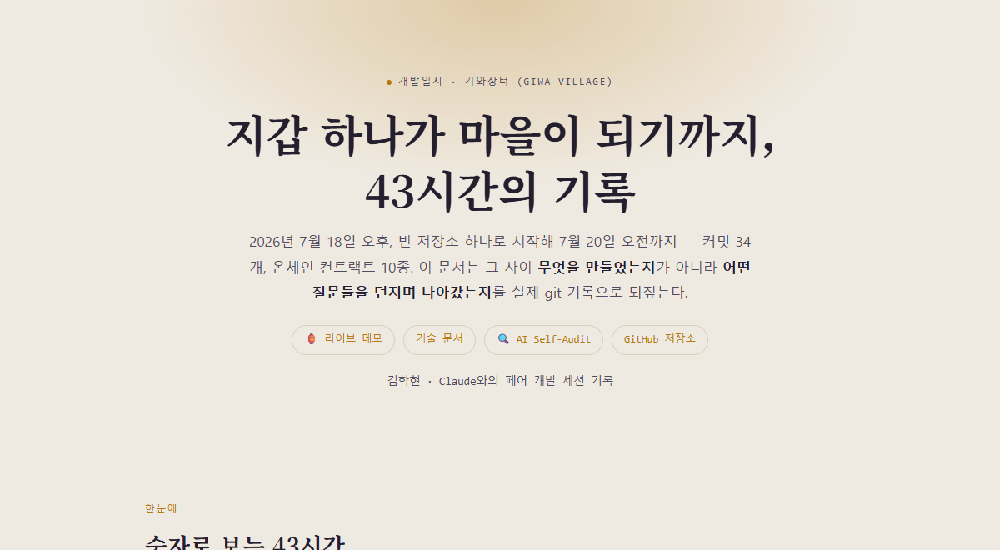

# 기와장터 (GIWA Village)

[](https://hakhyun-kim.github.io/giwa-village/)
[](https://hakhyun-kim.github.io/giwa-village/tech.html)
[](https://hakhyun-kim.github.io/giwa-village/audit.html)
[](https://hakhyun-kim.github.io/giwa-village/journal.html)

GIWA 체인 위의 **한옥 저잣거리** — 지갑으로 접속해 아바타로 마을을 돌아다니고,
노점을 열어 장사하고, 다른 주민에게 실제 ETH를 선물하고, 길드를 맺어 던전을 오르는
"지갑을 공간으로" 만드는 실험. 고전 MMO 저잣거리(노점) 문화의 온체인 재해석이다.

**지갑 전송을 선물로, P2P 거래를 노점으로, 신원 인증을 상인 뱃지로** —
지갑의 기능을 공간의 문화로 번역한다.

> 🌐 **[라이브 데모](https://hakhyun-kim.github.io/giwa-village/)는 풀온체인
> 서버리스입니다** — 게임 서버 없이 GIWA 체인만으로 동작합니다. 다른 방문자의
> 아바타(프레즌스 비컨)와 노점이 그대로 보이고, 테스트 ETH만 받으면 노점 개설 →
> 구매 → 길드 던전까지 전부 실동작합니다.
>
> **처음 오시면 촌장이 한 번 묻습니다** — *"마을을 대신 걸어서 보여줄까?"*
> **예**를 고르면 자막과 함께 자동 시연이 돌고(ESC로 언제든 멈춤), 잔액이 없으면
> **가스가 들지 않는 구경 모드**로 내려가 마을만 보여줍니다.
> 자세한 것은 [놀아 보기](guide/PLAY.md).

## 시연 영상 (1.5배속)


[▶ 원속도 mp4](media/demo.mp4) — `showcase.cmd` 실행을 그대로 녹화한 영상입니다.
구매·에스크로 정산은 GIWA Sepolia **실제 온체인 트랜잭션**입니다.

📓 **[개발일지](https://hakhyun-kim.github.io/giwa-village/journal.html)** — 주장이 아니라
git 기록으로 되짚은 작업 기록. 🔍 **[AI Self-Audit](https://hakhyun-kim.github.io/giwa-village/audit.html)** —
개발한 AI가 감사자로 전환해 찾은 결함·수정·**미해결 한계**를 전부 공개한 기록.

[](https://hakhyun-kim.github.io/giwa-village/journal.html)

## 마을에 무엇이 있나

**"머무를 이유 · 만날 시간 · 자랑할 것 · 만들 거리 · 함께 싸울 상대"** 다섯 축
— 자세한 것은 [FEATURES.md](guide/FEATURES.md).

| | |
|---|---|
| 🧺 **장사와 거래** | 아무 곳에나 노점을 편다. 접속을 끊어도 노점은 남는다. 에스크로+ERC-1155 쿠폰, 온체인 흥정, 쿠폰 선물·소각 |
| 🏯 **길드 + 백층 던전** | 비동기 코업. 주차 시드가 블록 해시로 고정돼 **오른 층수를 누구나 재현·검증**할 수 있다 |
| 🧿 **도깨비 토벌** | 광장의 주간 보스를 함께 때려잡는다. 기여가 온체인에 쌓이고 전리품은 소울바운드 |
| 🔥 **모닥불 + 장날** | 함께 앉아야 온기가 쌓인다. 토 21시(KST) 장날엔 2배 — 모두가 모일 시간 |
| 🎨 **꾸미기 + 창작** | 칭호·랜덤박스 장신구·**문양 공방**(8×8 픽셀 UGC, 대금 창작자 직송) |

## 온체인 구성 (GIWA Sepolia)

설계 원칙은 **"가치는 전부 온체인, 존재감은 비컨"** — 거래·소유·기록은 컨트랙트가
들고, 실시간 위치만 저장 없는 이벤트로 흘린다. 그래서 **게임 서버가 없어도 멀티플레이가
된다.** 컨트랙트 10종 전부 Blockscout 검증됨 (카탈로그: [contracts/README.md](contracts/README.md)).

| 컨트랙트 | 역할 |
|---|---|
| [**GiwaMarketV3**](https://sepolia-explorer.giwa.io/address/0x1f34506cda6619fc3124d68742a8fd5e7ba436e2) | 노점 레지스트리·에스크로(분쟁/환불)·ERC-1155 쿠폰(선물·소각) |
| [**GiwaGuilds**](https://sepolia-explorer.giwa.io/address/0x65e4de091071d2f0d47b24f1ada5c2c7ba2c7638) | 길드·백층 던전 (블록해시 시드·settleRun 재계산 검증) |
| [**GiwaPresence**](https://sepolia-explorer.giwa.io/address/0x4d600672cefae3c8462f3d9feb2cb739001e7a93) | 저장 없는 위치+속도 비컨 → 클라 데드레커닝 |
| [**GiwaHonors**](https://sepolia-explorer.giwa.io/address/0x7e230f68c4dabe64e6de231ea3085e50f0d5a57f) | 소울바운드 칭호 5종 (온체인 상태로 자격 검증) |
| [**GiwaOffers**](https://sepolia-explorer.giwa.io/address/0x534a29c47667b54eab6995517705cfbc423bb909) | 흥정 에스크로 (MarketV3 조합 즉시 체결) |
| [**GiwaBoxes**](https://sepolia-explorer.giwa.io/address/0xeb0349f00fc781c807b6d15c74d7f5fb15996b2e) | 랜덤박스(무료·블록해시)·소울바운드 장신구 8종 |
| [**GiwaHearth**](https://sepolia-explorer.giwa.io/address/0xf780265d5f49abd8c7e5d18d81d33426f62f3365) | 모닥불 온기 (함께·장날 2배) |
| [**GiwaWorkshop**](https://sepolia-explorer.giwa.io/address/0x664762337e529f853949a94e6ed50e6d8016c975) | 문양 공방 UGC (등록·판매·착용, 대금 창작자 직송) |
| [**GiwaBoss**](https://sepolia-explorer.giwa.io/address/0x8f50d882fc936f481f5f66d76156ebdf816cc6ae) | 주간 도깨비 토벌 (개인·길드 기여, 소울바운드 전리품) |
| [**GiwaProfile**](https://sepolia-explorer.giwa.io/address/0xefe0e8d69661fd67f5fe2368f9b1f7ff6d395416) | 소셜 프로필 애그리게이터 — 1콜로 길드·칭호·장신구·문양·온기·전리품 ([SDK](sdk/README.md) 진입점) |

여기에 GIWA 네이티브 읽기 연동 둘이 붙는다 — **Dojang Verified Address**(업비트가
신원을 보증한 상인 뱃지)와 **UP.ID 이름표**. 자세한 것은
[FEATURES.md](guide/FEATURES.md#-giwa-네이티브-읽기-연동).

## 마을은 구현체가 아니라 프로토콜이다

입장 자격이 **서명 하나**뿐이라, 컨트랙트에는 그 서명이 사람에게서 왔는지 에이전트
루프에서 왔는지, 그 좌표가 웹에서 왔는지 언리얼에서 왔는지 구분할 자리가 없다.
그래서 둘 다 열어 뒀다.

- **[PROTOCOL.md](PROTOCOL.md)** — 공개 명세. 배치·충돌·소리 임계는
  [`world.json`](client/public/world.json)으로 구워 누구나 읽는다.
  `npm run smoke:protocol`이 **문서만 보고 짠 클라이언트로** 실제 룸에 들어가 본다
  (colyseus.js를 일부러 안 쓴다 — 쓰면 아무것도 증명 못 한다).
- **[AGENTS.md](guide/AGENTS.md)** — 사람과 AI가 같은 자격으로 사는 마을.
  [MCP 서버](mcp/README.md)와 [LLM 상인 NPC](guide/AGENTS.md#llm-상인-npc)로 실제로 돈다.
  **값은 LLM이 제안하고 하한선은 코드가 강제**해서, 어떤 대답이 나와도 헐값 체결은 불가능하다.

## 빠른 시작

```bash
npm install
npm run showcase   # 자동 시연 — 설명 없이 보기만 해도 전체 플로우가 지나간다
npm run playtest   # 듀얼 테스트 창 (클라이언트 2개 + 봇 주민)
npm test           # 로직 56건 · 체인 없음 · 1초 미만
```

## 구조

```
PROTOCOL.md 공개 프로토콜 — 이것만 지키면 누구든 클라이언트를 만들 수 있다
guide/      사람이 읽는 문서 (놀기·이어붙이기·검증·이어만들기)
client/     Vite + React + react-three-fiber 3D 클라이언트
            src/chain/  풀온체인 레이어 — 컨트랙트별 모듈 (stalls·guilds·boss·presence…)
            public/world.json  마을 배치표(기계용) — npm run export-world 가 굽는다
core/       던전 판정 순수 모듈 — 클라이언트와 검증기가 같은 코드를 임포트한다
contracts/  Solidity 10종 (카탈로그: contracts/README.md)
sdk/        @giwa-village/sdk — 외부 dApp·봇용 읽기 SDK
mcp/        기와장터 MCP 서버 — LLM이 마을을 읽고 키가 있으면 직접 장사한다
server/     (선택) Colyseus 룸 서버 — 성능용 위치 릴레이. 없어도 마을은 돈다
scripts/    배포·검증·봇·스모크
```

## 📚 문서

| 찾는 것 | 문서 |
|---|---|
| 어떻게 노나 (실행·조작·자동 시연) | [guide/PLAY.md](guide/PLAY.md) |
| 마을에 무엇이 있나 (다섯 축·주야·소리·Dojang) | [guide/FEATURES.md](guide/FEATURES.md) |
| 테스트 ETH·지갑·포셋 | [guide/WALLET.md](guide/WALLET.md) |
| 어떻게 검증하나 (5겹 · 재현 가능성) | [guide/TESTING.md](guide/TESTING.md) |
| AI 에이전트로 마을 돌리기 | [guide/AGENTS.md](guide/AGENTS.md) |
| 다른 엔진으로 클라이언트 만들기 | [PROTOCOL.md](PROTOCOL.md) |
| 컨트랙트 카탈로그 · 알려진 한계 | [contracts/README.md](contracts/README.md) |
| 외부 dApp에서 프로필 읽기 | [sdk/README.md](sdk/README.md) |
| 로드맵 · 규제 안전선 | [guide/ROADMAP.md](guide/ROADMAP.md) |
| 반입 에셋 원장 (출처·라이선스) | [ASSETS.md](ASSETS.md) |
| 서버 호스팅 (선택) | [guide/DEPLOY.md](guide/DEPLOY.md) |
| 작업 규칙 (사람·AI 공용) | [CLAUDE.md](CLAUDE.md) |

전체 색인은 [guide/README.md](guide/README.md).

## 네트워크

| | |
|---|---|
| 체인 | GIWA Sepolia (OP Stack L2) |
| Chain ID | 91342 |
| RPC | https://sepolia-rpc.giwa.io |
| 익스플로러 | https://sepolia-explorer.giwa.io |

## 설계 원칙 (규제 안전선)

게임 플레이의 결과로 양도 가능한 자산을 지급하지 않는다.
성장치는 소울바운드, 거래는 소셜 레이어의 지갑 기능(전송·선물·재화)으로만.
자세한 것은 [guide/ROADMAP.md](guide/ROADMAP.md#설계-원칙-규제-안전선).
