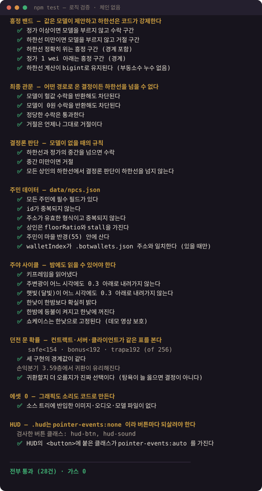
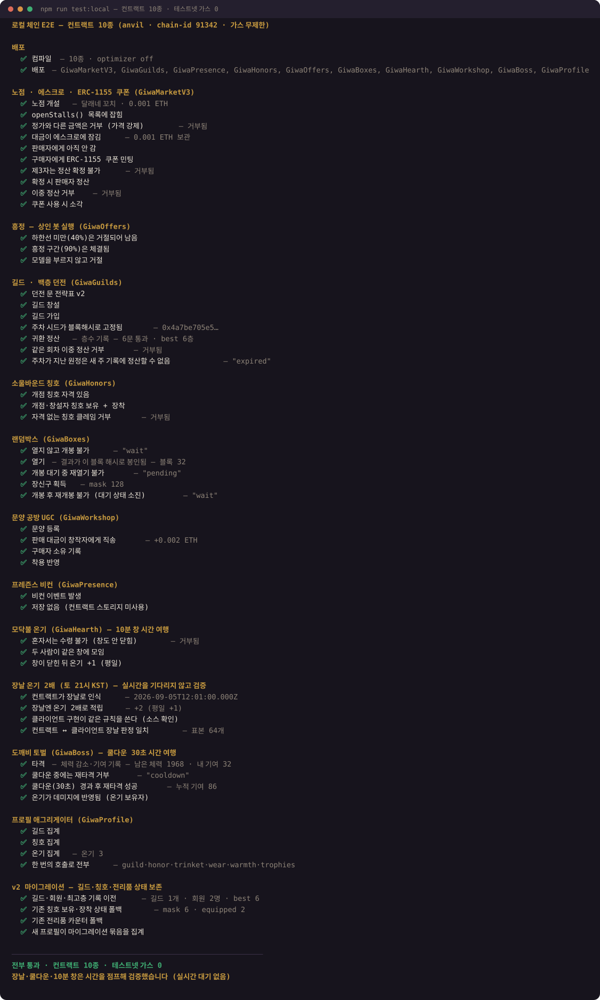
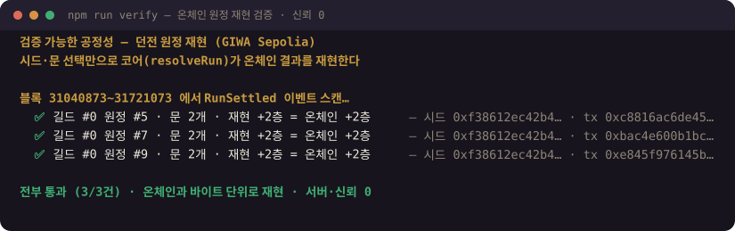

# 검증 — 가스를 아끼는 순서

[← 문서 색인](README.md)

포셋이 주소당 24시간 0.005 ETH라, 테스트를 실거래로만 하면 금방 막힌다.
그래서 **가스가 드는 검증은 마지막 한 겹으로 밀어 두고**, 나머지는 전부 공짜로 돌린다.

| 명령 | 무엇을 | 가스 | 걸리는 시간 |
|---|---|---|---|
| `npm test` | 로직·데이터·조명 하한·밸런스 표 대조·마을 충돌·공개 프로토콜 (62건) | **0** (체인 없음) | 1초 미만 |
| `npm run test:local` | **컨트랙트 10종 전체** + 장날·쿨다운·v2 이전 (54건) | **0** (로컬 anvil) | ~7초 |
| `npm run smoke:boot` | 실브라우저로 **첫 방문자 동선** 부팅 검사 | **0** (읽기만) | ~40초 |
| `npm run smoke:protocol` | [PROTOCOL.md](../PROTOCOL.md)**만 보고 짠** 클라이언트로 룸 입장 (colyseus.js 안 씀) | **0** (로컬 서버) | ~10초 |
| `npm run verify` | 온체인 등반 기록을 시드로 재현·대조 | **0** (읽기만) | ~10초 |
| `npm run test:chain -- --yes` | 실제 배포본·GIWA 네이티브 연동 확인 | 읽기만 (0) | ~10초 |
| `npm run market-smoke` 등 | 실거래가 꼭 필요한 검증 | **든다** | 분 단위 |

```bash
npm test              # 저장할 때마다 돌려도 되는 계층
npm run test:local    # 컨트랙트를 건드렸으면 여기까지
npm run smoke:boot    # 데모를 배포하기 전 (CI가 자동으로 돌린다)
npm run test:chain -- --yes   # 배포 전 최종 확인
```

## `npm test` — 규칙이 맞나

체인도 지갑도 네트워크도 쓰지 않는다. 흥정 하한선 강제(모델이 헐값 수락을 반환해도
차단되는지), 주민 데이터 정합성, 야간 조명이 읽을 수 있는 밝기인지, 던전 문 확률이
컨트랙트·서버·코어 세 곳에서 같은지, 한옥을 뚫고 지나가지 않으면서도 모닥불·도깨비·
포털까지 걸어갈 수 있는지, 주민 걸음이 한 틱에 한 걸음을 넘지 않는지, 소리와 화면의
임계가 같은지, 반입 에셋 원장이 최신인지, HUD 버튼의 `pointer-events` 누락까지
62건을 검사한다. CI에서도 돈다.



**표를 옮기지 말고 굽는다** — 배치·충돌·소리 임계의 원본은 TypeScript 한 곳이고,
`client/public/world.json`은 그것을 기계가 읽는 형태로 구운 생성물이다
(`npm run export-world`). `npm test`는 아예 **`world.json`만 읽는 낯선 클라이언트인 척**
마을을 걸어 본 뒤 웹 클라이언트가 밀려난 자리와 1mm 안에서 같은지 대조한다.
굽는 것을 잊으면 여기서 잡힌다.

## `npm run test:local` — 컨트랙트가 맞나

anvil을 **chain-id 91342(GIWA Sepolia와 동일)** 로 띄우고 컨트랙트 10종을 전부
컴파일·배포한 뒤 마을의 주요 흐름을 돌린다. 체인 가드가 통과하고 코드 경로가
프로덕션과 같으므로 진짜 E2E다 — 가스만 무한할 뿐.

에스크로 보관·가격 강제 revert·이중 정산 거부·쿠폰 소각, 길드 창설·던전 원정·회차
이중 정산 거부, 칭호 자격 검증, 랜덤박스 봉인→개봉, 문양 대금 창작자 직송,
프레즌스 무저장 확인, 프로필 1콜 집계, v2 상태 이전까지 54건.

> **로컬 체인의 진짜 값어치는 공짜보다 시간 여행이다.** 테스트넷에서는 실제로 그
> 시각이 될 때까지 기다려야만 확인할 수 있던 것들을 초 단위로 점프해 검증한다 —
> **장날(토 21시 KST) 온기 2배**, 도깨비 타격 쿨다운 30초, 모닥불 10분 창이 닫힌 뒤에야
> 수령 가능. 덤으로 컨트랙트(Solidity)와 클라이언트(TS)의 장날 판정이 표본 64개에서
> 일치하는지도 대조한다 — 어긋나면 HUD는 "장날!"인데 실제로는 2배가 아닌 상태가 된다.

실제 실행 결과 (`node scripts/render-run.mjs`로 자동 생성 — 손으로 쓴 게 아니라
그때 그 실행의 출력이다):



> anvil은 **일부러 의존성에 넣지 않았다.** Windows에서 postinstall이 깨지고,
> optional로 두면 `--omit=optional`을 쓸 수밖에 없는데 그러면 rolldown 네이티브
> 바인딩까지 빠져 배포 빌드가 깨진다. 없으면 `test:local`이 설치 방법만 안내하고
> 종료하므로 아무것도 망가지지 않는다. 쓰려면 한 줄:
>
> ```bash
> npm i @foundry-rs/anvil --ignore-scripts --no-save
> ```

## `npm run smoke:boot` — 마을이 실제로 뜨나

여기까지가 전부 "규칙이 맞나"를 봤다면, 이건 **마을이 실제로 뜨는가**를 본다.
`VITE_DEMO=1`로 빌드한 산출물을 진짜 크롬으로 열어서 캔버스 부팅 → 노점·주민 등장 →
**환영 카드(자동 시연을 볼지 묻는 카드)** → 촌장의 부탁 노출 → 풍류 토글 → 오디오
그래프(믹서·리버브·자리 소리) → 주민 걸음 속도 → 벽 충돌 → **"자동으로 둘러보기"를
고르면 시연이 실제로 시작되고 ESC로 멈추면 안내가 돌아오는지**까지 밟고,
미처리 예외와 콘솔 에러가 하나라도 있으면 실패한다.
**GitHub Actions에서 배포 앞에 붙어 있어서, 깨진 데모는 애초에 올라가지 않는다.**

> 요령 둘. **빈 localStorage(첫 방문자)로 연다** — 개발자 브라우저에는 온보딩
> 진행 기록이 남아 있어, 그대로 검사하면 "처음 온 사람에게만 나는 문제"를 영영
> 못 잡는다. 그리고 **공개 테스트넷 RPC에서 온 에러는 일부러 걸러낸다** — 남의
> 레이트리밋으로 게이트가 빨간불이 되면 사람은 곧 그것을 무시하게 되고,
> 그 순간 게이트는 죽은 장치다.

## `npm run smoke:protocol` — 문서만 보고도 붙나

[PROTOCOL.md](../PROTOCOL.md)만 읽고 짠 클라이언트로 실제 룸에 들어가 본다.
**colyseus.js를 일부러 쓰지 않는다** — 쓰면 아무것도 증명하지 못하기 때문이다.
서버는 스크립트가 알아서 띄우고 끝나면 정리한다.

## 검증 가능성 (`npm run verify`)

위의 것들이 "우리 코드가 맞나"를 보는 것이라면, 이건 **제3자가 우리를 신뢰하지 않고도
확인할 수 있는가**를 본다. 던전 등반 기록이 조작되지 않았다는 걸 증명하려면
"믿어달라"가 아니라 **같은 계산을 남이 돌려서 같은 값이 나오는 것**이어야 한다.

주차 시드는 GIWA 블록 해시로 고정되고, 문 결과는 `keccak(시드, 길드, 회차, 스텝, 문)`
으로 결정된다. 그래서 `settleRun` 트랜잭션의 입력(문 선택)과 그 주의 시드만 있으면
게임 서버도 지갑도 API 키도 없이 오른 층수를 재현해 온체인 `RunSettled` 이벤트와
대조할 수 있다. 판정 로직은 [`core/`](../core/)에 순수 함수로 한 벌만 두고 —
클라이언트·검증기가 같은 코드를 임포트한다(`@giwa-village/core`).

```bash
npm run verify                        # 배포 이후의 원정 전부를 재현·대조
node scripts/verify-run.mjs 0x<tx>    # 특정 귀환 tx 하나만
```



게임 안에서도 같은 걸 한다 — 귀환 직후 **🔒 이 결과 검증하기**를 누르면 방금 확정된
층수를 시드로부터 다시 계산해 온체인 값과 맞는지 보여준다.

> **검증 가능성과 예측 불가능성은 같은 축의 양 끝이다.** 이 결정론은 되돌려 말하면
> 한계다 — 시드가 공개된 뒤에는 오프라인으로 무함정 경로를 찾을 수 있다. 테스트넷에서
> 걸린 것은 양도 불가 기록뿐이라 "확인할 수 있음"을 택했고, 메인넷에서는 정산 시점
> 엔트로피가 필요하다. 커밋-리빌과 VRF의 트레이드오프, 그리고 어느 쪽을 왜 고르는지는
> [컨트랙트 문서의 메인넷 엔트로피 절](../contracts/README.md#메인넷-엔트로피--알려진-한계와-이관-계획)에
> 적어 두었다.

## 실거래가 정말 필요할 때

```bash
npm run smoke         # 동기화: 접속/이동/이모트/좌표클램프/퇴장
npm run gift          # 선물 온체인 E2E: A→B 실제 전송 + gift 브로드캐스트
npm run stall-smoke   # 노점 E2E: 개설→실결제 구매→판매 전파→영속성→폐점 + 거부 케이스
npm run market-smoke  # 컨트랙트 E2E: 리스팅→가격 강제→영수증 이벤트→미등록 폴백
node scripts/dojang-smoke.mjs  # Dojang isVerified 조회 경로 확인
node scripts/upid-smoke.mjs    # UP.ID 역방향 조회 확인
```

`gift`/`stall-smoke`/`market-smoke`는 슬롯 A/B 지갑에 GIWA Sepolia ETH가 있어야
실행된다 ([WALLET.md](WALLET.md)). GIWA 고유 연동(Dojang·UP.ID)은 로컬에서 흉내 낼 수
없으므로 `test:chain`이 그 부분만 읽기로 확인한다.

## 장날 라이브 관찰

로직은 로컬에서 증명했지만 실제 체인 시계 위에서도 같은지 보고 싶다면,
토요일 21시(KST) 창 안에서:

```bash
npm run market-day             # 읽기만 — 지금 장날인지, 다음은 언제인지 (가스 0)
npm run market-day -- --live   # 실측 — 2인 모임 → 창 닫힘 → 수령이 +2인지 (약 10분)
```

## 자동화 훅

| 훅 | 쓰임 |
|---|---|
| `?rafshim` | 숨은 탭에서 rAF가 스로틀돼 헤드리스 검증이 멈추는 것을 막는다 (30Hz 타이머) |
| `?debug` | 프로덕션 빌드에서도 `window.__giwa` 노출 (개발 서버는 항상 노출) |
| `window.__giwa` | `state()` `pos()` `teleport(x,z)` `ready()` · `bossHit(n)` 타격 연출만 흉내(가스 0) · `walls()` `blocked(x,z)` 충돌 검사 · `mood(트랙, 남은체력)` 배경음 트랙만 갈아 끼우기 · `remotes()` 주민·타 플레이어 좌표 |
| `?showcase=1` | 무조작 자동 시연 (시각을 정오로 고정 — 영상 보호) |
